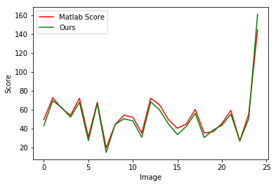

# PyBRISQUE
An implementation of BRISQUE (Blind/Referenceless Image Spatial Quality 
Evaluator) in Python from the paper: ["No-Reference Image Quality Assessment 
in the Spatial Domain"](https://ieeexplore.ieee.org/document/6272356/).


## Installation
The package is in PyPI so you can install it simply by this command:

```pip install --process-dependency-links pybrisque```

## Usage
Initialize once:
```
brisq = BRISQUE()
```
and get the BRISQUE feature or score many times:
```
brisq.get_feature('/path')
brisq.get_feature('/image_path')
```


## Limitations
This implementation is heavily adopted from the original Matlab 
implementation in [here](https://github.com/dsoellinger/blind_image_quality_toolbox/tree/master/%2Bbrisque). There is one catch though, the bicubic interpolation when resizing image in 
Matlab and OpenCV is a bit different as explained in [here](https://stackoverflow.com/questions/26823140/imresize-trying-to-understand-the-bicubic-interpolation). For now, it uses ```nearest``` interpolation 
which gives the most similar output with the original implementation.

Comparing with Matlab original implementation on reference images of TID 2008: 


 
And the absolute differences' stat is as follows: 
```
{'min': 0.17222238726479588,
 'max': 16.544924728934404,
 'mean': 3.9994322498322754,
 'std': 3.0715344507521416}
```


